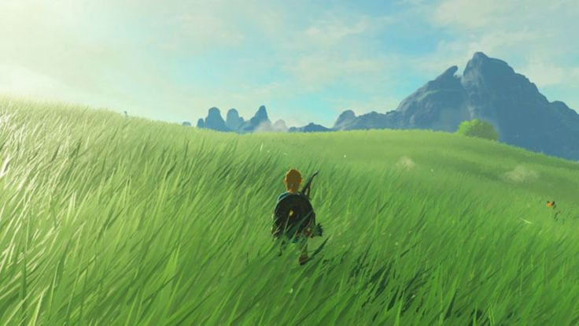
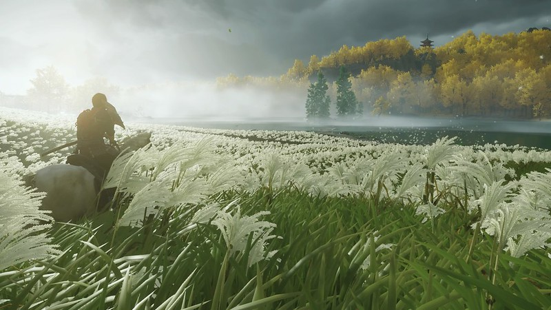

# Grass Field Simulation

Time to touch some grass, well not literally but....it's a Grass Simulation

A Grass Simulation Experiment with a **Toon Realism vibe** and **wind effects**. Not only, one can simulate with different counts of grass blades but also adjust wind speeds. Winds that carry story of time over the entire field. Inspired by **The Legend of Zelda: Breath of the Wild** and **Ghost of Tsushima**

<table>
  <tbody>
    <tr>
      <td >
        
        

          Breath of the Wild
        

      </td>
      <td>
        
        

          Ghost of Tsushima
        

      </td>
    </tr>
  </tbody>
</table>

In this simulation, one can simulate 5 counts of Grass Strands: 100k, 200k, 300k, 400k, 500k and 10 levels of wind speed from 0 to 10. In addition to that, the world is explorable! Feel free to use keyboard and mouse to move around the 100 x 100 Grass Field

## Index
- [Art Style](#Art-Style)
- [Simulation Instructions](#Simulation-Instructions)
- [Performance Metrics](#Performance-Metrics)
- [Lighting Used ( procedural )](#Lighting-Used-(-procedural))
- [File Structure](File-Structure)
- [Intuition](#Intuition)
- [Resources](#Resources)

## Art Style

A Toon Style art inspired by the mentioned games, but with still in-touch with realism: **Height Variation** for Grass Strands, Different **Color Patches** of Grass Strands ( Noise based ), **Wind Mechanics** and **Light Interaction**. And an environment, from Zelda, to fill up the background space.

## Simulation Instructions

**Stats Panel:** Present in the Top Left Corner of the screen, will display the metrics such as FPS, per frame MS etc..
**Configuration Panel:** Present in the Top Right Corner of the screen, will display the simulation paramenters namely: Grass Blade Count and Wind Speed

- Open the URL where the simulation is hosted
- The simulation is initilized with 100k blades and Wind Speed 2
- Use **WASD keyboard** to move around and **mouse** to decide the direction to move towards

## Performance Metrics

**System Information: **
- **CPU:** 13th Gen Intel(R) Core(TM) i7-13700HX
- **GPU:** NVIDIA GeForce RTX 4050 Laptop GPU
- **RAM:** 16GB, SSD

### Performance Results:

<table>
  <thead>
    <tr>
      <th>100k</th>
      <th>300k</th>
      <th>500k</th>
    </tr>
  </thead>
  <tbody>
    <tr>
      <td>  
        
        

          FPS 160
        

      </td>
      <td>
        
        

          FPS 110
        

      </td>
      <td>
        
        

          FPS 90
        

      </td>
    </tr>
  </tbody>
</table>

### Memory:
The **JS Heap Memory** hovers around **6.3MB** to **9.3MB**. Depending upong the Grass Strand count and movement

### Performance Techniques:

- Chunking / Tiling of the terrain
- Custom Frustum Culling
- Level Of Detail
- GPU Instancing
- Procedural Generation
- QuadTree for Spatial Querying
- 
## Lighting Used ( procedural ):
- Specular lighting ( using Normals )
- Flat Diffuse Colors
- AO

## File Structure

<table>
  <tbody>
    <tr>
      <td>  
        
      </td>
    </tr>
  </tbody>
</table>

**Conscise explanation:**
- index.html, index.css, and index.js ( trigger point ): Base Setup
- grassField.js: Responsible for Three.js Setup, this file acts like a communicator between files
- Controller.js: Responsible for Player Movement
- ChunkManager.js: Responsible for chunking up the Terrain, managing LOD, frustum culling and initializing grass strands
- DebugPanel.js: Responsible for display stats panel and configurable panel ( listening to changes in configuration )
- GrassStrand.js: Responsible for creation of a single blade of grass
- vertex.vs, fragment.fs: Responsible for procedural generation
- QuadTree.js: Spatial Querying

## Intuition
Normally, when creating a 3D object, one would just create a Mesh and that just works fine. But when the number of Meshes increase, this method simply fails to be performant ( too many draw calls ). The next probable choice is ( **Batching** )"Merging" Meshes with same materials together, and well that could be used but at the loss of "fine" control over geometry. Moving on, "**Instancing**" is the word that comes next in our minds, basically creating copies of same mesh multiple times, with different transformations. And that is the best solution in our case: Grass strand and multiple copies of it. 

But if we just create everything on CPU, it's of no use because we are talking about 100k to 500k grass strands. Each Frame, not only we have to handle the data related to those strands, but **update** transformations, materials and LODs. That's why we move everything to GPU, "**GPU Instancing**". We utilize the power of GPU, and **procedurally** generate everything: the grass strand itself, positioning multiple instances, animating and finally colouring them. This all is **shader magic**

But that itself is not enough to handle a huge scene like this. We had to employ some tricks to make it manageable to render the scene: **Chunking**, **LOD** and **Frustum Cullin**g. In simpler words, why to render the entire terrain at once? The player won't be seeing all of the terrain at once, just a small section of it - which naturally leads us to the idea of "Chunking / Tiling" and Frustum Culling. That kind of allows us to tell the computer "Hey, The player can only look in the front, why to waste energy rendering the tiles behind the player". 

Well, we can make it even better because just because we can see multiple tiles in-front of us, doesn't mean we need to render them in high quality. Why to waste energy rendering far off objects in best possible resolution, when it just covers tiny amount of screen space? This naturally leads us to the idea of LOD. We have 3 LOD most detailed to least detailed. These are all concepts, we need to make sure that each frame when some movement happens, we process everything in the quickest possible way and that's where **QuadTrees** come in, combining everything together we have got our *hopefully* performant output

## Resources
- [ Shader Hash Functions ](https://github.com/Angelo1211/2021-Shaders/blob/master/hashes.glsl)
- [ Field of Grass Swaying In The Wind ]( https://discourse.threejs.org/t/field-of-grass-swaying-in-the-wind/13965 )
- [ How to Make the fluffiest grass with Three.js ]( https://tympanus.net/codrops/2025/02/04/how-to-make-the-fluffiest-grass-with-three-js/ )
- [ LOD Instancing ]( https://discourse.threejs.org/t/lod-instancing/20524 )
- [How do Major Video Games Render Grass?](https://www.youtube.com/watch?v=bp7REZBV4P4&t=120s)
- [Coding Challenge #98.1: Quadtree Series](https://www.youtube.com/watch?v=OJxEcs0w_kE&t=1552s)
- [3D World Generation: #3 (Quadtree & LOD)](https://www.youtube.com/watch?v=YO_A5w_fxRQ&t=303s)
- [ Basic Lighting OpenGL ](https://learnopengl.com/Lighting/Basic-Lighting)
- [ GDC Talk - Procedural Grass in 'Ghost of Tsushima' ](https://www.youtube.com/watch?v=Ibe1JBF5i5Y&t=307s)

